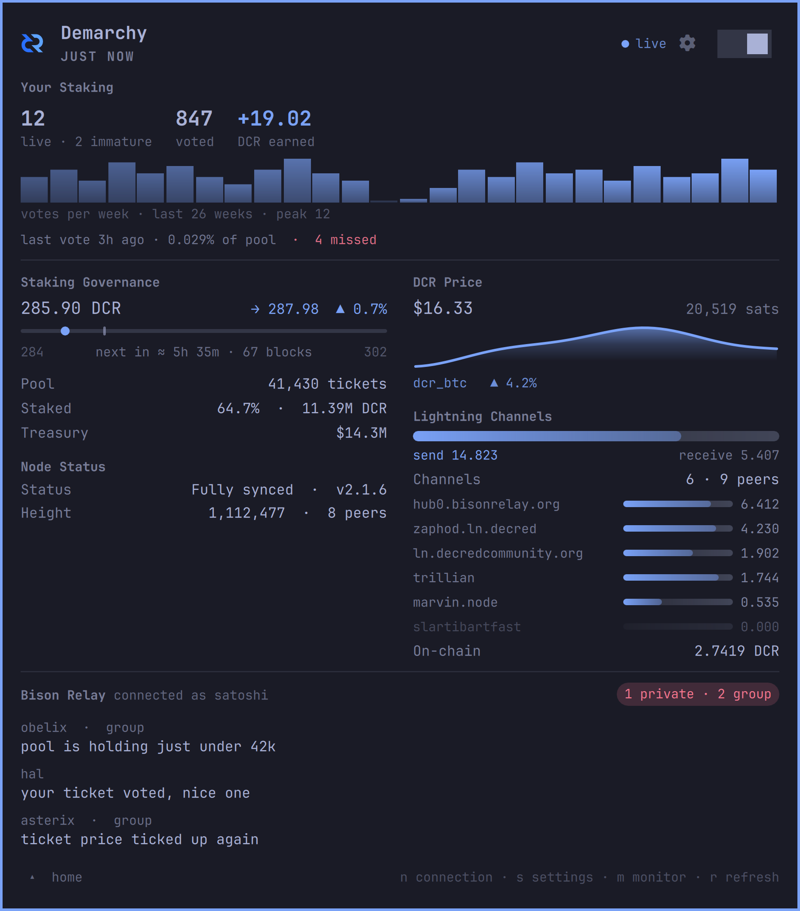

# Demarchy

> **de·mar·chy** *(n.)*: government by officials picked at random rather than
> elected. The Athenians ran most of their city this way.
>
> It is also, rather wonderfully, how Decred works. Every block, five tickets are
> drawn from the live pool and their holders vote on whether the last block
> stands. No campaigning, no queue-jumping: just the lottery.
>
> And the drawn tickets are not there to rubber-stamp. Three of five against and
> a miner's block loses its transactions. They gate every change to the consensus
> rules, and off-chain they choose what the treasury pays for.

A Decred mark for the [Omarchy](https://omarchy.org/) bar. Click it and the first
thing you see is your own staking record: tickets live, votes cast, DCR earned,
and when one of yours last voted. Under that, the network you are voting in:
ticket price and where it is heading, the pool, the staked supply, the DCR price,
your Lightning channels and Bison Relay.

The mark lights up when new messages arrive in
[Bison Relay](https://github.com/companyzero/bisonrelay), the zero-knowledge
messenger built on Decred.
A picture, a file or a Lightning invoice sent in a chat shows as an icon with
its caption, filename or amount, never as the tag it travels in.



Everything comes from [dcrpulse](https://github.com/karamble/dcrpulse) over its
MCP interface, with a token that can only read.

## Install

```bash
omarchy plugin add https://github.com/karamble/demarchy.git --enable
cd ~/.config/omarchy/plugins/karamble.demarchy && make build
```

**The second line matters.** No binaries are shipped here, so the two small Go
helpers are compiled on your own machine. It needs Go 1.24 or newer and builds
nothing else. The panel says so if you skip it, and offers to run it for you.

Nothing is installed outside this folder and `~/.config/demarchy`. If you want
an agent to know how the alerts work, have it run `demarchy-setup skill`, which
prints the guide; see Alerts.

Then add a connection, flip the switch in the panel, and you are done.

## Updating

```bash
omarchy plugin update karamble.demarchy
cd ~/.config/omarchy/plugins/karamble.demarchy && make build
```

The update is a git pull inside the plugin folder, so the agent skill follows
it by itself: the links point into that folder. The two binaries are built
locally and need the second line every time.

## Connections

Got more than one dcrpulse? A home box and a VPS, say. Demarchy holds as many as
you like: the active one is named in the panel footer, and `n` opens the list.

Add, edit and remove them in **Settings → Connections**, or from a terminal:

```bash
demarchy-setup              # add one
demarchy-setup list         # what is stored
demarchy-setup check        # re-validate them
demarchy-setup remove vps   # delete one and its token
```

They live in `~/.config/demarchy/connections.json` at mode 0600.

**Anything that isn't localhost has to be https**, since the token rides along on
every request. Type a bare remote host and it gets https automatically.

There is one exception, for a WireGuard mesh, where the tunnel already provides
what https would. It is off unless you turn it on, it lives in the config file
rather than the settings page, and it is narrow on purpose:

```bash
demarchy-setup allow-http 100.83.12.7/32 --via wt0
demarchy-setup allow-http acekool.blacknet.internal
demarchy-setup disallow-http 100.83.12.7/32
```

Only carrier-grade NAT addresses, `100.64.0.0/10`, which is what mesh software
hands out and what ordinary home and cafe networks never do. The traffic is
pinned to the interface you name, so with the tunnel down nothing is sent at all
rather than sent to whoever answers.

A mesh hostname works too, and has to be listed the same way. Being listed is
not enough on its own: the name is resolved once when the connection is made,
and the address it answers with has to be one of the ranges above, or nothing is
sent. So the ranges stay the statement of what is reachable and the name is only
what you call it.

Type the endpoint with an explicit `http://` either way. A bare host is promoted
to https on purpose, so plain text is something you ask for rather than
something you fall into.

## The token

Each connection carries its own MCP token. In the dcrpulse dashboard, under
**Settings → AI Agents**, make an agent like this:

```
domains:      node, staking, bisonrelay, wallet
              (add lightning, treasury, dex, audit or brmcp if you want those bits)
write scopes: (none)
spend:        do not grant
allowed IPs:  127.0.0.1
```

**Anything that can write or spend is turned down.** A thing that lives in your
status bar has no business moving your money.

**Use the allowed-IPs field.** It is an IP whitelist, and it is the control that
makes a stolen token worthless: dcrpulse will only accept it from an address you
listed. For a dcrpulse on this machine that is `127.0.0.1`. For one across a
tunnel or a VPN, list the address your machine actually reaches it from.

A token typed into the settings page passes through the Quickshell process on
its way to the helper: down a pipe, never an argument list or the environment.
If you would rather it never touched the shell at all, add the connection from a
terminal.

## Removing it

```bash
demarchy-setup purge              # connections and tokens, and the alerts board
omarchy plugin remove karamble.demarchy
```

Do the purge first. Removing the plugin takes the plugin folder away but leaves
`~/.config/demarchy/` behind, and what is in there is bearer tokens. Nothing
else is left anywhere: demarchy writes nothing into your agents' directories, so
there is nothing of its outside those two places to go looking for.

Purging deletes them from this machine; it does not revoke them. If you want a
token dead everywhere, delete its agent in the dcrpulse dashboard under
**Settings, AI Agents**.

## What you see depends on the token

Demarchy shows exactly what your token may read, so granting another domain in
the dashboard makes a section appear on its own.

| domain | what turns up |
|---|---|
| `node` | chain status, height, peers |
| `staking` | your staking record, ticket price, countdown, pool, staked supply |
| `bisonrelay` | messages, the unread badge, and the DCR price |
| `wallet` | balances, hidden until you ask for them |
| `lightning` | channel inbound/outbound |
| `treasury` | the treasury, in dollars |
| `dex` | the DCRDEX spot and its premium over the exchange, and the DCR/BTC chart |
| `audit` | MCP Audit: what every agent did with money, newest first |
| `brmcp` | BRMCP: bot payments waiting for your approval, and the bridge spend log |

`node` and `staking` are the two you really want. `demarchy-setup check` tells
you what your actual token unlocks.

## Settings

| | default | |
|---|---|---|
| `monitoring` | off | A proper off switch: off means no connection is opened at all |
| `countPrivate` | on | Private messages raise the unread count |
| `countGroupchat` | on | So do group messages, so a lively group will keep the mark lit |
| `showBalances` | off | Whether balances appear; masked until you reveal them |
| `activeConnection` | first stored | Set by the footer switcher |

## Alerts

Demarchy already watches your dcrpulse every few seconds. Alerts let that
watching wake something up.

An alert is a condition on a value the panel already shows, armed by you or by
an AI agent, with a reason and an expiry. When it trips, demarchy rings: it sends
a message into the agent's session through herdr, or a desktop notification to
you. The woken agent then looks at dcrpulse itself and decides what to do.

Demarchy never does the looking or the doing. It holds a read-only token, it
never answers a question about live data, and it never acts on anything. It
watches, remembers what is armed, and rings. That is the whole job, on purpose.

```bash
demarchy-setup catalogue                                    # what can be watched
demarchy-setup arm price.dcrUsd crosses --above 16 \
    --expires 4d --reason "sell leg of the rebalance"      # arm one
demarchy-setup alerts                                       # what is armed
demarchy-setup edit t-7f3a9c21 --above 17 --expires 2d      # change one in place
demarchy-setup arm node.height stalls --for 45m --expires 2d --dry-run   # check, save nothing
demarchy-setup disarm t-7f3a9c21
```

Every verb takes `--json` for a machine. Params by operator: `--above X` or
`--below X` (with `--rearm R` to set the re-arm margin), `--value V` (with
`--hold 5m`), `--by X` (with `--percent`), `--for 45m`, and `--where field=value`
or `--where field~=text` for a substring, with `--key field` to choose what
counts as the same list entry.

Run from inside a herdr pane, `arm` knows which agent it is and delivers back to
it. Run from a plain terminal, it delivers to you. Every alert expires, and each
one rings once unless you pass `--standing`. `--dry-run` validates and prints
the alert as it would be stored, without saving it.

Agents learn all of this by being told to read it. `demarchy-setup skill` prints
the guide and `--recipes` prints one worked example per condition; both are in
`docs/` for anyone reading the repository directly.

It only prints. Nothing is written into `~/.claude/skills`, `~/.agents/skills`
or anywhere else a coding agent looks, because a bar widget that quietly changes
how every agent on the machine behaves is doing more than a bar widget should.
An agent that wants the guide asks for it, the way it would ask for `--help`.

What can be watched is exactly what is in the panel: the ticket price and its
window, your tickets, the node's height and peers, wallet balances, Lightning
liquidity and channels, the DCR price, the DCRDEX spot and its premium over the
exchange, and Bison Relay messages. Five kinds of
condition: `crosses` a level, `becomes` a value, `changes` by an amount or
percent, `stalls` for a duration, and `appears` or `disappears` from a list.
Nothing costs an extra request; the widget is fetching it anyway.

### Agents and spends

Two sections in the left column watch the agents themselves, each behind its
own grant. `audit` shows dcrpulse's spend audit: every write attempt by every
agent, who, which tool, how much, and whether it went through, was denied, or
tripped the spend limit and got the agent's token revoked. `brmcp` shows the
Bison Relay MCP bridge: bot payments parked for your approval, with a countdown,
and what the bridge paid recently. A new request and a revoked agent each raise
a desktop notification on their own, no alert needed. Both are read-only, on
purpose: nothing in demarchy approves a payment, and no agent ever can. The
click stays in the dcrpulse dashboard. The `brmcp` section needs a dcrpulse
build that carries the bridge resource.

Two things to know. A stall clock survives restarts, so a chain that stopped
moving before you restarted the shell still rings on time. And **off means
off**: when monitoring is paused, alerts are not watched, and the bar and the
panel say so loudly rather than pretending.

Press `a`, or the bell beside the gear, for the alerts view: what is armed, for whom, with how long left,
grouped by the agent that will hear it. Edit a value, disarm one, or arm a new
one for yourself. Alerts live in `~/.config/demarchy/triggers.json`, the same
0600 home as your connections.

## Keys

Omarchy is keyboard-first, and so is this.

| | |
|---|---|
| `n` | connection switcher |
| `s` | settings, and back |
| `a` | alerts, and back |
| `m` | monitoring on/off |
| `b` | reveal balances |
| `r` | refresh now |
| `↑ ↓` `enter` | move and choose |
| `← →` | pick an action on a row |
| `esc` | close |

The bar item does one thing: click opens the panel. No hidden right- or
middle-click tricks. Wire up your own keybinds if you like:

```bash
omarchy-shell karamble.demarchy toggle
omarchy-shell karamble.demarchy connections
omarchy-shell karamble.demarchy useConnection vps
omarchy-shell karamble.demarchy toggleMonitor
omarchy-shell karamble.demarchy alerts
```

## Requirements

- Omarchy 4.x with the Quickshell bar
- A dcrpulse you can reach, with its MCP interface on
- Go 1.24+ to build: the helpers use nothing outside the standard library

`bin/demarchy --demo` prints a made-up snapshot and holds it open, for laying out
the staking panel on a wallet that has never bought a ticket.

♥ to [DHH](https://github.com/dhh) and [Omarchy](https://github.com/basecamp/omarchy).

ISC licensed, as Decred software is. See `LICENSE`.
